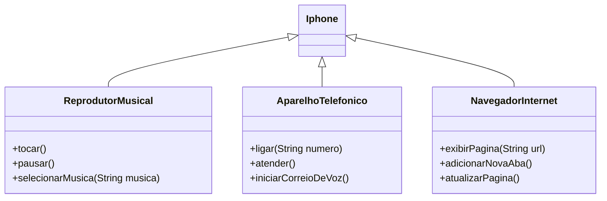

# iPhone Simulation Program

## Descrição

Este projeto simula algumas funcionalidades de um iPhone utilizando conceitos de Programação Orientada a Objetos (POO). As funcionalidades modeladas incluem um reprodutor musical, um aparelho telefônico e um navegador da internet.

## Funcionalidades Implementadas

### Exemplo de Diagrama UML (Mermaid)



### Reprodutor Musical

- **Métodos:**
  - `tocar()`
  - `pausar()`
  - `selecionarMusica(String musica)`

### Aparelho Telefônico

- **Métodos:**
  - `ligar(String numero)`
  - `atender()`
  - `iniciarCorreioDeVoz()`

### Navegador na Internet

- **Métodos:**
  - `exibirPagina(String url)`
  - `adicionarNovaAba()`
  - `atualizarPagina()`

## Código Principal

A classe `Iphone` simula interações com as três funcionalidades principais do iPhone.

```java
import java.util.Scanner;

public class Iphone {
    public static void main(String[] args) throws Exception {
        AparelhoTelefonico celular = new AparelhoTelefonico();
        NavegadorInternet navSafari = new NavegadorInternet();
        ReprodutorMusical iTunes = new ReprodutorMusical();

        Scanner scanner = new Scanner(System.in); 

        System.out.println("Olá eu sou a Siri! Bem ao seu Iphone!");
        iTunes.selecionarMusica("No lie ");
        iTunes.pausar();
        scanner.nextLine();

        System.out.println("Sua mãe esta ti ligando.");
        celular.atender();
        celular.ligar("Pai");
        celular.iniciarCorreioDeVoz();
        scanner.nextLine();

        System.out.println("Safari aberto");
        navSafari.adicionarNovaAba();
        navSafari.exibirPagina("google.com.br");
        navSafari.atualizarPagina();
        scanner.close();
    }
}
```

